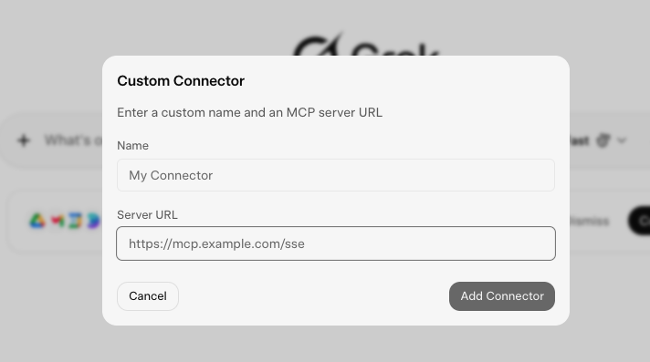
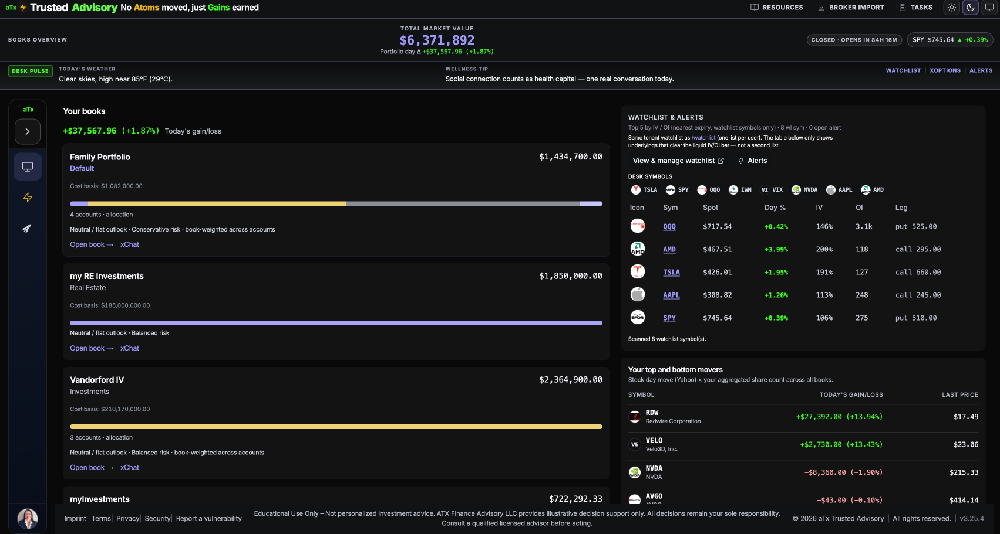
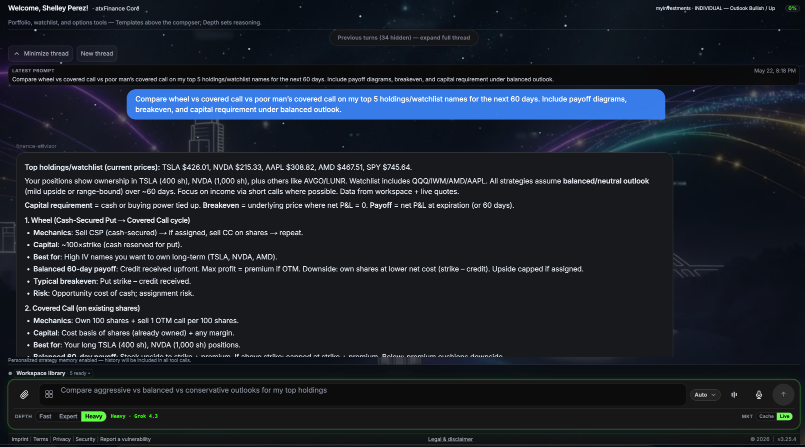
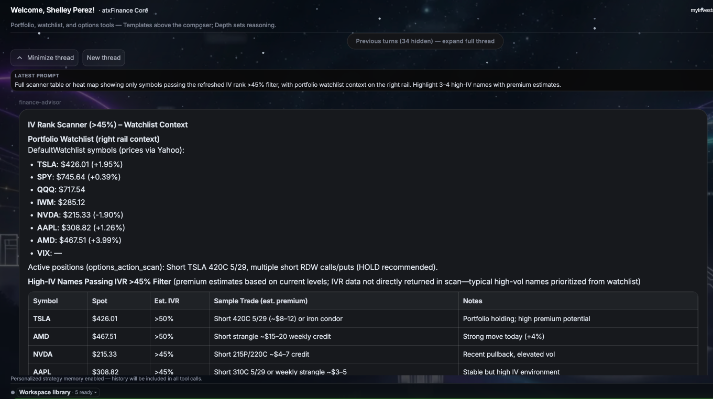
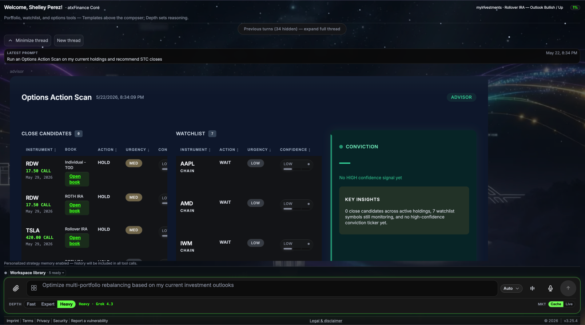
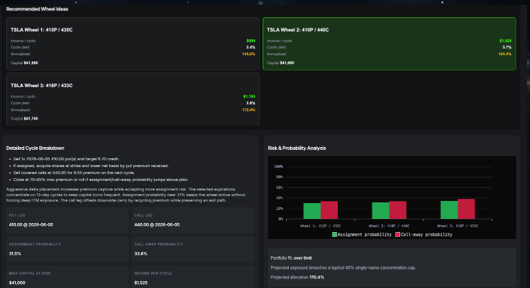
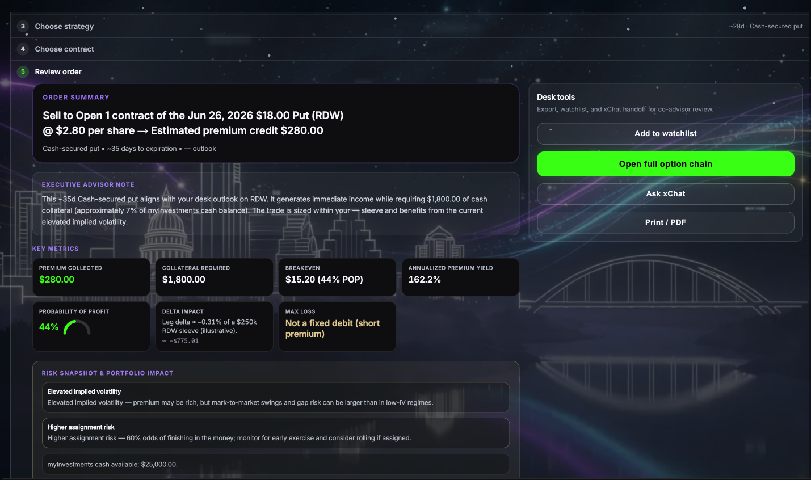
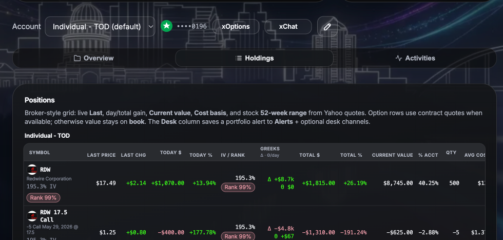

# xFinance Rental AI — Public MCP & Agent Handoff (v1.1.1)

**White-label, tenant-isolated Grok-powered options-aware advisor HTTP API.**

This repository is the **official public landing** for partners, MCP tool authors, A2A implementers, and LLM crawlers. It contains everything you need to build a high-quality integration against the Rental AI surface **without** access to the private monorepo.

**Production base URL:** `https://fintech-advisor.ai`

**Live OpenAPI (canonical):** `GET https://fintech-advisor.ai/api/openapi` — filter by tag `rental-ai`

**Preferred MCP endpoint (self-onboarding):** `https://fintech-advisor.ai/mcp`  
Use this native endpoint with your `atxr_*` rental key when adding a Custom Connector in Grok. It reuses the full internal logic (no separate proxy needed).

**Discovery document (recommended first call):**  
`GET https://fintech-advisor.ai/mcp/discovery` (live) or [`discovery/mcp.json`](discovery/mcp.json) (pinned in this repo)

---

## For MCP Tool Authors (Fast Path)

1. Read this README (you are here).
2. Authenticate with a per-tenant `atxr_<id>_<secret>` Bearer key (scopes: `chat`, `strategy`, `analyze`).
3. Map one MCP tool per primary operation (or use the reference implementation in `examples/mcp-server/`).
4. Handle **SSE streaming** for chat and the **202 + poll** pattern for strategy/analyze jobs.
5. Surface the metering headers (`x-rental-tokens-used`, `x-rental-tokens-remaining`) to your users.
6. For deeper patterns, error shapes, and production reference code, see **[docs/mcp-implementation-guide.md](docs/mcp-implementation-guide.md)**.

You should be able to ship a working MCP server in < 1 day.

---

## Authentication

All requests require:

```
Authorization: Bearer atxr_<16-hex-key-id>_<64-hex-secret>
```

- Keys are minted per tenant via the admin API or ops tooling in the core platform.
- Each key declares one or more scopes. Routes enforce the matching scope.
- Keys are **never** logged in plaintext by the server.

**Do not** ship real keys in client code or public examples. Use environment variables and placeholder tokens in documentation.

---

## Core Capabilities

| Capability | Method & Path | Scope | Behavior |
|------------|---------------|-------|----------|
| **Chat** | `POST /api/ai/rent/chat` | `chat` | Natural language query with tenant `strategyBias` + workspace snapshot injected server-side. Returns markdown (or SSE stream). |
| **Strategy** | `POST /api/ai/rent/strategy` | `strategy` | `{ symbols[], portfolioId?, notes? }` → `202` with `jobId` + `pollUrl`. Poll for options strategy materialization. |
| **Analyze** | `POST /api/ai/rent/analyze` | `analyze` | `{ jobId?, deepRun? }` → `202` + poll. Deep portfolio / position analysis. |

### Chat (JSON + SSE)

**Request:**
```json
{
  "message": "Outline a conservative wheel income plan on NVDA using my current book.",
  "username": "partnerDesk",           // optional X handle → resolves to tenant member
  "portfolioId": "507f1f77bcf86cd799439011", // optional; scopes to owned portfolio
  "stream": false
}
```

**Success (200 JSON):**
```json
{
  "ok": true,
  "correlationId": "...",
  "tenantSlug": "acme-ia",
  "data": {
    "response": "# Conservative Wheel on NVDA\n...",
    "model": "grok-4-1-fast-reasoning",
    "usage": { ... }
  }
}
```

**Headers on success:**
- `x-rental-tokens-used`
- `x-rental-tokens-remaining`

**Streaming:** Send `Accept: text/event-stream` **or** `"stream": true`. Server emits OpenAI-style `chat.completion.chunk` deltas and terminates with `data: [DONE]`.

See the implementation guide for robust SSE client patterns.

### Strategy Job (async)

```bash
# Start
curl -X POST "$ORIGIN/api/ai/rent/strategy" \
  -H "Authorization: Bearer $RENTAL_TOKEN" \
  -d '{"symbols":["NVDA","SPY"],"notes":"conservative bias"}'

# Poll
curl "$ORIGIN/api/ai/rent/strategy?jobId=$JOB" \
  -H "Authorization: Bearer $RENTAL_TOKEN"
```

Returns `202` with `{ jobId, pollUrl }`. Poll until `status: "completed"` (MVP currently materializes quickly).

### Analyze Job

Same 202 + poll pattern. Use after a strategy job or standalone with `deepRun: true`.

---

## Recommended MCP Tool Shapes

For best ergonomics in agent frameworks:

- `rental_ai_chat(message, portfolioId?, stream?)` — primary conversational surface
- `rental_ai_create_strategy(symbols[], notes?, portfolioId?)` — returns jobId immediately
- `rental_ai_poll_strategy(jobId)` — or a combined "wait for completion" helper
- `rental_ai_analyze(jobId?, deepRun?)`

Expose the metering headers on every successful response so the host UI can show remaining budget.

**Never** claim the outputs are personalized financial advice. The server injects a standard disclaimer; your wrapper should too.

---

## Token Budgets & Guardrails

- Default **200,000 tokens / UTC day** per tenant (`maxDailyTokens` in `rentalProfile`).
- Failed guardrails (safety, policy) do **not** consume tokens.
- Concurrency cap (currently 8 per tenant) when Redis is enabled.
- Clients should treat `429` with `Retry-After` or the metering headers as signals to back off.

---

## Add xFinance to Grok (public Custom Connector)

**Prerequisite:** You need a tenant **Rental AI API key** (`atxr_<16-hex-id>_<64-hex-secret>`) with scopes `chat`, `strategy`, and/or `analyze`. Public Grok accounts cannot call `/mcp` without one — request onboarding from your **aTx Finance / xFinance** contact (or your firm’s tenant admin).

### Steps (grok.com)

1. Open **[grok.com/connectors](https://grok.com/connectors)** (or **Settings → Connectors** in the Grok app).
2. Choose **New Connector** → **Custom**.
3. Fill the dialog (same fields as the UI below):

   | Field | Value |
   | ----- | ----- |
   | **Name** | `xFinance Rental AI` (or your tenant display name) |
   | **Server URL** | `https://fintech-advisor.ai/mcp` |

   

4. Click **Add Connector**.
5. When Grok asks for **credentials** / **Authorization**, paste your full rental key as a **Bearer** token:

   ```
   Bearer atxr_<your-key-id>_<your-secret>
   ```

   Some builds accept only the token body (`atxr_...`) without the `Bearer ` prefix — if one fails, try the other.

6. Confirm the connector lists tools such as `rental_ai_chat`, `rental_ai_create_strategy`, `rental_ai_get_strategy`, `rental_ai_create_analyze`, `rental_ai_get_analyze` (see [`discovery/mcp.json`](discovery/mcp.json) or `GET https://fintech-advisor.ai/mcp/discovery`).
7. In a Grok chat, enable the connector and try: *“Use xFinance Rental AI to outline a conservative wheel on NVDA.”*

**Grok Business / team:** Admins can publish the same URL under **Apps** in [console.x.ai](https://console.x.ai) so the connector is pre-approved for the org (plan-dependent).

**Why this URL:** The native `/mcp` endpoint runs on the production app with full personas, workspace context, RAG, metering (`x-rental-tokens-*`), and guardrails — no separate proxy required.

**Troubleshooting**

| Symptom | Fix |
| -------- | ----- |
| `401` / unauthorized | Key missing or wrong format; ensure `Authorization: Bearer atxr_...` on MCP POSTs. |
| Connector saves but no tools | Open `GET https://fintech-advisor.ai/mcp/discovery` in a browser; redeploy may be needed if empty. |
| Streaming stalls | Set `stream: false` on `rental_ai_chat` first; see [implementation guide](docs/mcp-implementation-guide.md). |

The standalone example in [`examples/mcp-server-http/`](examples/mcp-server-http/README.md) is for **self-hosted** MCP only (your own `https://…/mcp` URL + optional `MCP_AUTH_TOKEN`).

---

## Product screenshots (marketing proof)

Preview images below are **committed in this repo** under [`docs/assets/marketing/`](docs/assets/marketing/) so GitHub README renders reliably (relative paths — no dependency on GitHub’s camo proxy or prod deploy state).

| Preview | File (in repo) | What it shows |
| ------- | -------------- | --------------- |
|  | `01-portfolios.png` | Multi-book portfolio desk + watchlist IV/OI rail |
|  | `01-covered-call.png` | xChat — wheel vs covered call vs PMCC on holdings |
|  | `02-scanner-iv45-hits.png` | IV Rank scanner (>45%) + watchlist context |
|  | `03-xchat-option-scan.png` | xChat options action scan — close candidates |
|  | `04-new-defined-risk-wheel-card-1920x1080.png` | Wheel ideas — income, yield, assignment (16:9) |
|  | `05-xoptions-step4-payoff-preview-1200x630.png` | xOptions review — CSP, advisor note, POP (1200×630) |
|  | `06-portfolio-context-greeks-overlay-1920x1080.png` | Holdings grid — IV rank + Greeks |

**Production CDN (after main app deploy):** `https://fintech-advisor.ai/marketing-screenshots/<filename>` — same filenames from `public/marketing-screenshots/` in the core app. As of the last check, prod may still return **404** until that tree ships; use repo paths for docs and social until then.

**Embed on GitHub (recommended):**

```markdown

```

**Embed on the live site (post-deploy):**

```markdown

```

Pair copy with **“No Atoms Moved. Just Gains Earned.”** — do not invent live metrics or testimonials beyond what each capture shows.

**Social sizing:** `01-weekly-recap-dark-1200x630.png` and `05-xoptions-step4-payoff-preview-1200x630.png` for X/OG; `*-1920x1080.png` for LinkedIn document posts (full set in core app `public/marketing-screenshots/`).

Full filename → channel matrix: `atx-docs/xchat/xfinance-branding-review.md` §9 in the private monorepo.

---

## Quickstarts

See **[examples/README.md](examples/README.md)** for copy-paste curl commands and the reference MCP server.

Minimal curl smoke test:

```bash
export XFINANCE_ORIGIN="https://fintech-advisor.ai"
export RENTAL_TOKEN="atxr_...your-key..."

curl -sS "$XFINANCE_ORIGIN/api/ai/rent/chat" \
  -H "Authorization: Bearer $RENTAL_TOKEN" \
  -H "Content-Type: application/json" \
  -d '{"message":"One paragraph on wheel vs buy-write for NVDA.","stream":false}' \
  | jq .
```

---

## Machine-Readable Indexes

| File | Purpose |
|------|---------|
| [`llm.txt`](llm.txt) | Ultra-dense summary for LLM context windows and RAG |
| [`llms.txt`](llms.txt) | [llms.txt](https://llmstxt.org/) standard entry |
| [`discovery/mcp.json`](discovery/mcp.json) | MCP server discovery manifest (tools, auth, capabilities) — live at `/mcp/discovery` |
| [`openapi/rental-ai.yaml`](openapi/rental-ai.yaml) | Pinned OpenAPI 3.1 snapshot (rental-ai paths & schemas only) |

---

## Versioning & Source of Truth

- **Handoff surface (this repo):** v1.1.1 (this document + domain migration to fintech-advisor.ai)
- **API contract:** Phase 1 — paths and major schemas are stable
- **Live spec:** `GET /api/openapi` (always filter tag `rental-ai`)
- **Private implementation:** `atx-trusted-advisor` monorepo (`atx-docs/MCP-AI-ADVISOR.md`, `sre-ops/rental-ai-platform.md`)

When the underlying API evolves, this public mirror and docs are updated via the process in `AGENTS.md`.

---

## Compliance

Outputs are **educational only** and **not personalized investment advice**. No trade execution or order routing occurs through this API. All responses should carry appropriate disclaimers in your integration surface.

---

## Next Steps for Integrators

- Read **[docs/mcp-implementation-guide.md](docs/mcp-implementation-guide.md)** for streaming clients, polling loops, error taxonomy, and production TypeScript / Python examples.
- Clone `examples/mcp-server/` as a starting point for your own tool.
- Contact your aTx Finance representative for tenant onboarding, key issuance, and commercial terms.

**No atoms moved. Just gains earned.**
